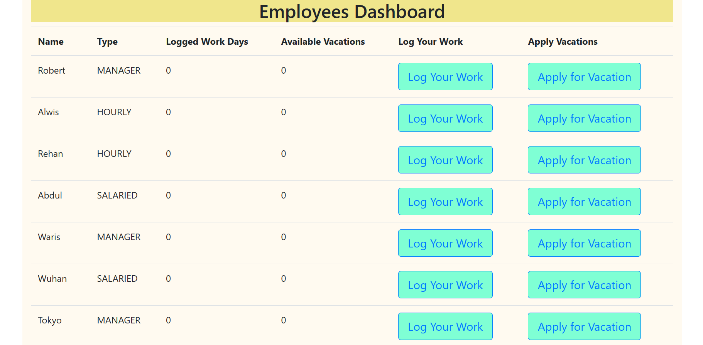

# Employee TimeSheet Management

## User Interface

- Action
  - Log Your Work : By clicking on this button you can log work days.
  - Apply for Vacation : By clicking on this button you can apply for vacation.
 
 


## About tech used

This application was developed using Spring Boot, H2 Database, JPA and Angular.

## Versions Required

Java - 1.8

Maven - 4.x.x

Angular - 8.3.25

Nodejs - 14.18.2

## Steps to Setup development environment

- Install version v14.18.2 from nodejs from https://nodejs.org/en/

- Install Angular cli using below command

```
npm -g install @angular/cli@8.3.25
```
- In Eclipse/Spring STS import EmployeeTimeSheet Project

	Steps : 
	- Click on File menu
	- Click on Import sub menu
	- Search for 'Existing projects into Workspace' option and click next
	- Browse folder and click on finish

- Build the angular code

	- go to EmployeeTimesheet\fecode\employeetimesheet and run below commands in git bash

```bash
npm install
ng build --prod
```

- Build and run the app using maven

	- go to EmployeeTimesheet folder and run below command in git bash

```bash
mvn clean install
```
	- Now go to sts/eclipse and start Spring Boot application by right clicking and Run as Spring Boot Application
	
The app can be accessed at <http://localhost:8080> from any modern browser.

## Explore Rest APIs

The App defines following CRUD APIs.

APIs:

- GET - /api/v1/employee - Get All Employees
- POST - /api/v1/employee/work - To Log work
- POST - /api/v1/employee/vacation - To take vacation

You can test them using postman or any other rest client.